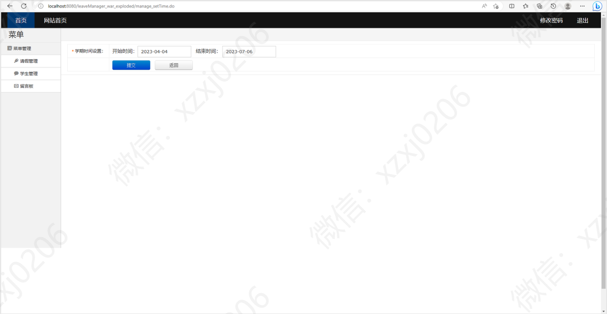
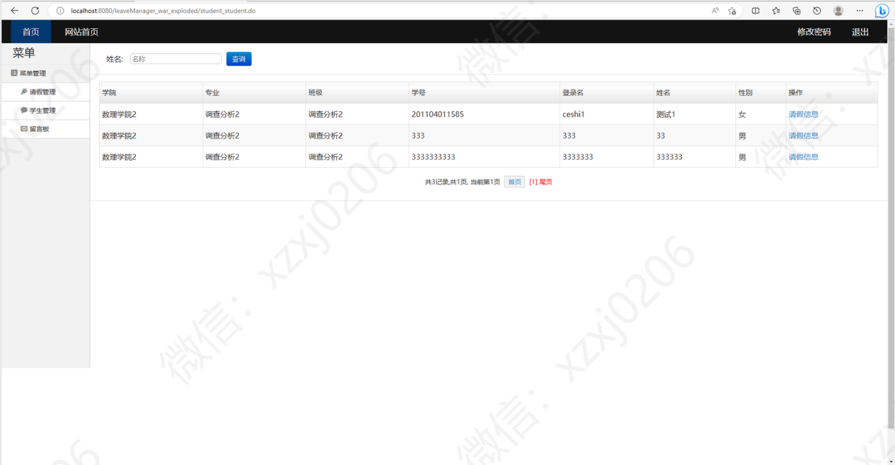
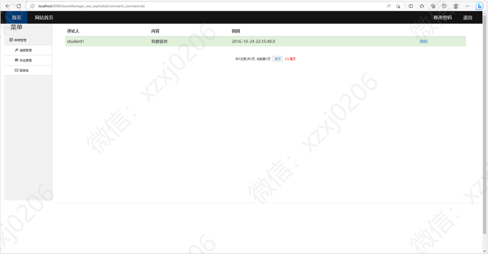

# 学生请假系统

### 有问题，或者需要协助调试运行项目的, 可以+扣扣：2529519551，或者+ wx ：xzxj0206  注明项目，“git+项目名称” ，如：“git学生宿舍管理系统”

## 一、介绍

#### 基于jsp+Servlet+Spring+Hibernate+Struts的学生请假系统

Java学生请假管理系统源码

功能介绍：

（1）管理员模块

定义一个最高级管理员，可以对整个系统进行查询修改等操作，浏览修改其他管理员的相关信息，添加新的管理员使其成为系统管理员。定义二级管理员为班主任，可以对请假系统进行查询、修改、批准、统计等操作；最后定义一级管理员为任课教师，可以进行查询、修改所负责课程的请假情况。

（2）教师信息管理模块

教师可在登陆后对个人的信息进行修改和查询等功能，同时，教师可以查看本班学生的基本信息，如：年级、专业、班级、学生学号、姓名、性别等，还可以查看本班学生上课出勤信息，例如本班学生整个学期有关课程的上课出勤统计信息及详细信息。

（3）班级信息管理模块

主要负责班级信息的整理记录，例如学院、专业等基本信息，由此统计学生请假情况，便于学校计算学生成绩，还可以实现在校学生信息的查询和修改等一系列功能。

（4）请假管理模块

本模块的功能是在线请假的实现以及管理。结合院校的请假制度，大体分为事假、病假。事假，写明正当事由，交由教师审批；病假：需具备病例、处方单和付款单方可有效。有效病假以及事假对于平时成绩的扣分是不同。统计请假信息后可以查看学生请假情况，统计学生请假记录，最后算出学生的平时成绩。

（1）学生管理模块：

学生可以查看自己的基本信息和修改登陆密码；在提交请假申请后，可以在已提交和待审核的表单中查看请假单的信息；待辅导员审核通过后，通过表单状态的判断显示在已通过的表单记录中；未审核通过的请假单将显示在未通过的表单记录中。

（2）后台管理模块：

管理员可以按照四年更新一次的方式，删除和添加毕业生和新生的有关信息；对实际操作过程中出现的错误或者不符合规范的请假信息进行删除；并且可以添加用户、进行授权操作。

（3）公告信息模块：

此模块即为系统所有用户的一个通知信息作用，在页面的首页显示最新的公告信息；一般为管理员发布公告。

（4）留言板模块：

在页面中设有留言板的入口，这是一个公众的平台，所有用户都可以发言。此模块一是用户可以及时反映出系统具体操作中存在的不足，方便后期开发和维护；二是大家可以有一个交流互动的平台，增加师生间的交流。

## 二、系统运行界面

## 三、部分页面功能展示

### 1、管理员部分页面功能展示

### 2、教师部分页面功能展示

### 3、学生部分页面功能展示

